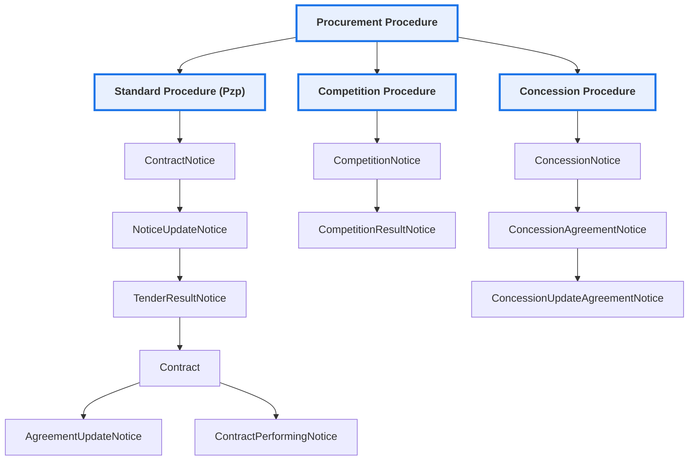

# Public Procurement Notice Types in Poland (eZamowienia API)

## Legal Framework

These notice types are defined under the Polish Public Procurement Law
(Prawo zamówień publicznych -- Pzp) and, in the case of concessions,
under the Act on Concession Contracts for Construction Works or
Services.

------------------------------------------------------------------------

# 1. Notices Initiating Proceedings

## ContractNotice

**Contract Notice** -- Initiates a competitive public procurement
procedure.\
It includes: - Description of the subject-matter of the contract\
- Participation conditions\
- Award criteria\
- Deadline for submission of tenders

This is the primary starting point of a procurement lifecycle.

## CompetitionNotice

**Competition Notice** -- Initiates a design or project competition
(e.g., architectural competition).\
The objective is to select the best work, not directly a contractor.

## ConcessionNotice

**Concession Notice** -- Initiates a concession procedure.\
In a concession, remuneration consists primarily of the right to exploit
the works or services (possibly combined with payment).

------------------------------------------------------------------------

# 2. Intention to Conclude a Contract (Non-Competitive Procedures)

## AgreementIntentionNotice

**Notice of Intention to Conclude a Contract** -- Published when the
contracting authority intends to award a contract without a competitive
procedure (e.g., negotiated procedure without publication).\
Its purpose is to ensure transparency and allow for possible legal
remedies.

## ConcessionIntentionAgreementNotice

**Notice of Intention to Conclude a Concession Contract** -- Equivalent
notice within the concession regime.

------------------------------------------------------------------------

# 3. Notices Concluding Proceedings

## TenderResultNotice

**Contract Award Notice / Tender Result Notice** -- Published after the
contract is awarded and concluded.\
Includes: - Name of the awarded contractor\
- Contract value\
- Number of tenders received

This is a key data source for analytical systems.

## CompetitionResultNotice

**Competition Result Notice** -- Publishes the outcome of a competition
procedure.

## ConcessionAgreementNotice

**Concession Contract Award Notice** -- Published after the conclusion
of a concession contract.

------------------------------------------------------------------------

# 4. Notices of Changes

## NoticeUpdateNotice

**Notice of Change to Contract Notice** -- Amends the original
procurement notice (e.g., deadlines, scope, requirements).

## NoticeUpdateConcession

**Notice of Change to Concession Notice** -- Amends a concession notice.

## AgreementUpdateNotice

**Notice of Change to Contract** -- Refers to modifications of an
already concluded contract (e.g., amendments under Article 455 Pzp).

## ConcessionUpdateAgreementNotice

**Notice of Change to Concession Contract** -- Refers to modifications
of a concluded concession contract.

------------------------------------------------------------------------

# 5. Contract Performance

## ContractPerformingNotice

**Contract Performance Notice** -- Published after the completion of
contract performance.\
May include: - Final contract value\
- Information on penalties\
- Completion status

Important for analyzing cost overruns and performance issues.

------------------------------------------------------------------------

# 6. Special Categories

## CircumstancesFulfillmentNotice

**Notice on Fulfilment of Conditions under Article 214(1)(11--14) Pzp**
--\
Relates to so-called "in-house" procurement, where a contract is awarded
directly to an affiliated entity.\
The notice confirms that statutory conditions for such an award are met.

## SmallContractNotice

**Small Contract Notice** -- Refers to contracts below the statutory
thresholds where the Public Procurement Law does not apply.\
Primarily informational in nature and typically less standardized.

------------------------------------------------------------------------

# Simplified Procurement Lifecycle Model

Concession procedures follow a parallel lifecycle structure.

